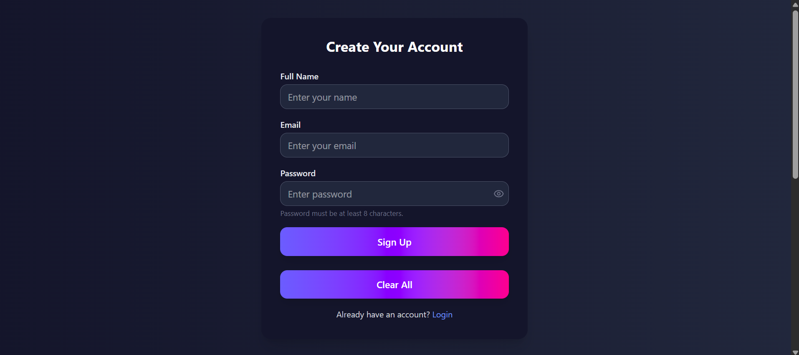

# React Component Development Assignment

### Project Overview
This project is a **React-based component development assignment** using **TypeScript** and **TailwindCSS**. It demonstrates UI components, page layouts, and interactivity built with modern React practices.

---

### Page View


---

### Installation

```sh
# Install dependencies
npm install
```
### Run Locally
```sh
# Start development server
npm run dev
```
## Technologies Used
- **React** – Frontend library for building UI components
- **TypeScript** – Adds static typing for safer code
- **TailwindCSS** – Utility-first CSS framework for styling
